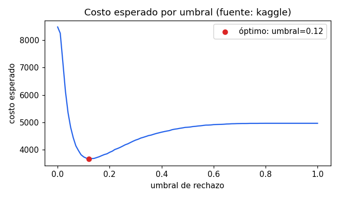

# Credit Risk Scoring with Explainability

End-to-end credit default prediction system: multi-table data validation →
domain + historical feature engineering → model comparison (Logistic Regression
vs LightGBM) → KS/AUC evaluation → **cost-based decision threshold
optimization** → SHAP explainability → **FastAPI scoring service** (Docker,
CI). Leakage-safe sklearn Pipelines, 17-test suite, train/serve parity.

**Live demo:** [credit-risk-scoring-58zh.onrender.com/docs](https://credit-risk-scoring-58zh.onrender.com/docs)
(Swagger UI — try `/score` interactively). Free-tier hosting sleeps after
inactivity, so the first request after a while can take ~30-60s to wake up;
subsequent requests are fast. Serves the real Kaggle-trained model — check
`/health` to confirm.

> **Data source disclosure:** the pipeline runs on the real Home Credit
> dataset when present (`data/download.sh`) and falls back to a synthetic
> generator with the same schema otherwise. Every artifact — `results.json`,
> the EDA notebook, the API's `/health` — declares which source was used.
> Metrics below are from the **real Kaggle dataset** (307,511 rows).

## Problem

A lender must decide which applications to approve. The two errors have
asymmetric costs:

| Error | Business meaning | Relative cost (configurable) |
|---|---|---|
| False Negative | approve an applicant who defaults | 1.00 |
| False Positive | reject a good customer | 0.15 |

Instead of only reporting AUC, the pipeline selects the **approval threshold
that minimizes expected cost** — the decision a risk team actually makes.



## Results (real Kaggle run, 307,511 rows, default rate 8.07%)

| Model | CV AUC (5-fold) | Holdout AUC | KS |
|---|---|---|---|
| Logistic Regression (baseline) | 0.7489 ± 0.0020 | — | — |
| **LightGBM (selected)** | **0.7689 ± 0.0016** | **0.7729** | **0.4104** |

LightGBM beats the linear baseline on CV — as expected on the real dataset,
which has stronger non-linear interactions than the synthetic fallback (where
the baseline wins, see `reports/` from a synthetic run). Model selection is
purely CV-driven; nothing is hardcoded.

Optimal decision: threshold **0.12** → approval rate **80.4%**, minimizing
expected cost given the FN/FP cost matrix (FN=2,266, FP=9,344, cost=3,667.6).
The threshold looks low compared to a naive 0.5 cutoff — that's expected and
correct: with an 8% base default rate and calibrated probabilities, a 12%
predicted PD is already well above average risk, and rejecting a good
customer (FP) costs much less than missing a default (FN) in the cost matrix.

**Probability calibration:** the model's raw `predict_proba` is checked
against actual outcomes, not just ranking (AUC/KS). Brier score = 0.0667,
Expected Calibration Error = 0.0028 — both very good (see
`reports/reliability_curve.png`). This wasn't the case initially: training
with `class_weight="balanced"` gave Brier = 0.1797 (**worse than just
predicting the base rate**, whose trivial Brier is 0.0742) and ECE = 0.30,
i.e. the model was systematically overestimating risk by ~10–30 percentage
points across the probability range, despite having good discrimination.
Removing `class_weight` fixed calibration almost for free — CV AUC actually
improved slightly and the cost-based business outcome barely moved. The
lesson: class weighting fights the same imbalance the cost-based threshold
already handles, and doing both distorts the probability scale for no
benefit. See `src/train.py` for the fix.

Top SHAP drivers (global): `EXT_SOURCES_MEAN`, `CREDIT_TERM`,
`PREV_CREDIT_APPLICATION_RATIO`, `GOODS_CREDIT_RATIO`, `CODE_GENDER` —
consistent with credit-risk domain knowledge (bureau scores and leverage
ratios dominate). No single `ORGANIZATION_TYPE` category cracks the
individual top 15 (its signal splits across ~18 one-hot dummies), but
summed as a group it ranks **7th** overall — real, worth the added
cardinality. Single-case explanations ("why was applicant X rejected")
in `reports/shap_case_example.csv`.

**High-cardinality categorical handled:** `ORGANIZATION_TYPE` (58 real
categories) is now in the model. `OneHotEncoder(min_frequency=0.01)` in
`src/train.py` already grouped rare categories automatically — no new code
needed there, just adding the column to `config.CATEGORICAL_COLS`. One
finding worth noting: `ORGANIZATION_TYPE == "XNA"` has exactly 55,374 rows —
the same count as the `DAYS_EMPLOYED == 365243` sentinel. It's the same
population (pensioners/unemployed), confirmed by Home Credit's own data
dictionary ("XNA" = not applicable).

**Real-data quirk handled:** `DAYS_EMPLOYED == 365243` is Home Credit's null
sentinel (~1000 years employed, mostly pensioners/unemployed; 18% of rows).
It's converted to `NaN` in `src/data.py` before feature engineering so it
flows through the same median imputer as any other missing value, instead of
silently collapsing to `EMPLOYED_YEARS = 0`. Covered by
`tests/test_pipeline.py::test_days_employed_sentinel_becomes_nan`.

**Outlier handled:** `AMT_INCOME_TOTAL` has a max of 117,000,000 (real
99.9th percentile is 900,000 — ~130x). `src/data.py::_cap_income_outliers`
clips it to a fixed 1,000,000 cap (a constant, not computed from the
train/test split, to avoid leaking test-set statistics — same principle as
the `DAYS_EMPLOYED` sentinel fix). The row is kept, not dropped: only the
one implausible value is capped. Affects 250/307,511 rows (0.08%); metrics
moved by noise-level amounts, as expected for a fix this narrow. Covered by
`tests/test_pipeline.py::test_amt_income_outlier_is_capped_not_dropped`.

**Anomaly documented, not corrected:** `CNT_CHILDREN` has 2 rows with value
19 (an abrupt jump from the typical max of 14). Left as-is — the volume is
negligible (2/307,511) and, unlike the income outlier, there's no clear
signal it's a data-entry error rather than a genuinely large family. See
`notebooks/01_eda.ipynb`.

## Architecture

```
application_train + bureau + previous_application   (real or synthetic)
        │  src/data.py        — schema validation, source disclosure
        ▼
multi-table aggregation      — per-client bureau/previous-app statistics
        │  src/aggregates.py  — BUREAU_*/PREV_* features, left join
        ▼
domain features              — credit/income ratios, tenure, EXT aggregates
        │  src/features.py    — pure row-wise functions (no leakage)
        ▼
sklearn Pipeline             — imputation/encoding fitted per-fold only
        │  src/train.py       — LogReg baseline vs LightGBM, stratified CV
        ▼
evaluation & decision        — AUC, KS, cost curve, optimal threshold
        │  src/evaluate.py
        ▼
explainability               — SHAP (Tree/Linear explainer auto-selected)
        │  src/explain.py
        ▼
model artifact               — models/model.joblib (model + threshold + schema)
        │
        ▼
FastAPI service              — POST /score → PD + approve/reject decision
        │  app/main.py        — train/serve parity via shared feature code
        ▼
Docker + GitHub Actions CI   — tests → train → API tests on every push
```

## Quickstart

```bash
pip install -r requirements.txt
python -m pytest tests/ -q          # 17 tests, <5 s, no external data needed
python run_pipeline.py --shap       # full run (synthetic fallback if no CSV)
uvicorn app.main:app --reload       # scoring service on :8000

# real data (requires Kaggle credentials + accepting competition rules):
bash data/download.sh && python run_pipeline.py --shap

# container:
docker build -t credit-scoring . && docker run -p 8000:8000 credit-scoring
```

Example request:

```bash
curl -X POST localhost:8000/score -H "Content-Type: application/json" -d '{
  "AMT_INCOME_TOTAL": 250000, "AMT_CREDIT": 400000, "AMT_ANNUITY": 25000,
  "DAYS_BIRTH": -14600, "DAYS_EMPLOYED": -4380,
  "EXT_SOURCE_1": 0.85, "EXT_SOURCE_2": 0.8, "EXT_SOURCE_3": 0.82
}'
# → {"probability_of_default": ..., "decision": "approve", "threshold": 0.12,
#    "model": "lgbm", "trained_on": "kaggle"}
```

## Design decisions

- **Leakage control:** every stateful transform (imputer, scaler, one-hot)
  lives inside the sklearn `Pipeline`, fit only on training folds. A test
  asserts engineered features are strictly row-wise. Multi-table aggregates
  use only each client's own history.
- **Honest model selection:** LightGBM must beat the logistic baseline on CV
  to be deployed; otherwise the simpler model ships.
- **Business metric first:** the deliverable is a threshold + approval rate +
  expected cost, not a leaderboard score.
- **Train/serve parity:** the API imports the same `add_domain_features` used
  in training and reindexes to the persisted feature schema; missing fields
  flow through the same imputer as in training.
- **Source honesty:** synthetic vs real data is tracked end-to-end and exposed
  in every artifact, including the API.
- **Graceful degradation:** MLflow and SHAP are optional imports; the pipeline
  runs without them.
- **SQL as an alternative, tested equivalent path:** `src/aggregates.py` also
  ships `aggregate_bureau_sql`/`aggregate_prev_sql`, which run the same
  groupby logic as DuckDB SQL directly over the CSVs on disk instead of
  loading the full table into pandas. The pipeline still runs the pandas
  version; the SQL version is proven equivalent on the full real dataset
  (305,811 / 338,857 clients, every column matched) in
  `tests/test_aggregates_sql.py`. The interesting bug this caught: pandas
  `.sum()` on an all-NaN group returns `0.0`, while SQL `SUM()` returns
  `NULL` — the SQL version uses `COALESCE(SUM(...), 0)` to match pandas
  exactly rather than silently diverging on edge-case clients.
- **No class rebalancing at training time:** neither model uses
  `class_weight="balanced"`. The cost-based decision threshold already
  handles the ~92/8 imbalance at the business-decision layer; rebalancing
  the training loss on top of that distorted `predict_proba` badly (see
  calibration finding above) for no gain in AUC/KS or expected cost. Two
  mechanisms solving the same problem stacked badly — solve imbalance in
  exactly one place.
- **High-cardinality categoricals need no special handling:** `OneHotEncoder(
  min_frequency=0.01)` in `src/train.py` already groups rare categories into
  an "infrequent" bucket. Adding `ORGANIZATION_TYPE` (58 real categories) was
  a one-line change to `config.CATEGORICAL_COLS` — no new encoding logic.

## Repository layout

```
app/main.py            FastAPI scoring service
src/                   config, data, aggregates, features, train, evaluate, explain
notebooks/01_eda.ipynb executed EDA with findings (declares data source)
tests/                 17 tests: schema, leakage, metrics, e2e, API contract
reports/               results.json, figures, cost curve, SHAP outputs
data/download.sh       Kaggle download script
Dockerfile · .github/workflows/ci.yml
```

## Tech stack

Python · pandas · DuckDB · scikit-learn · LightGBM · SHAP · MLflow · FastAPI · Docker · GitHub Actions · pytest

## Roadmap

- [x] Run on real Home Credit data; update all metrics and EDA findings
- [x] Handle `DAYS_EMPLOYED == 365243` null sentinel
- [x] Handle high-cardinality categoricals (`ORGANIZATION_TYPE`, 58 categories)
- [x] Probability calibration (reliability curves) for PD estimates —
      found and fixed a real miscalibration bug (`class_weight="balanced"`)
- [x] Deploy container to a public endpoint (Render) + demo link
